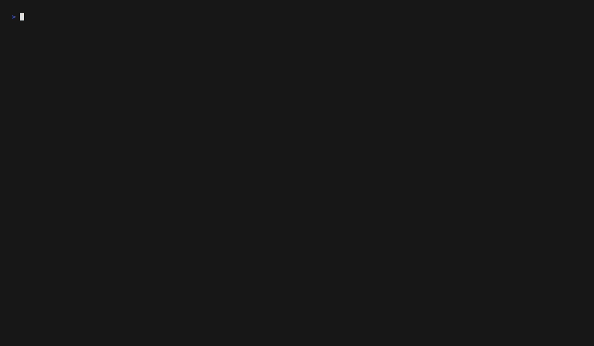

# AetherPdM — Predictive Maintenance for Rotating Equipment

[](https://github.com/LiamCarPer/AetherPdM/actions/workflows/ci.yml)
[](https://www.python.org/downloads/)
[](LICENSE)
[](docs/demo/)

**B2B condition monitoring + predictive maintenance** for bearings and rotating machinery.
From vibration signal to fault classification, health score, and operational alerts.

## The Problem

Unplanned downtime in industrial rotating equipment costs **$50B+/year** globally.
Maintenance teams are flooded with false alarms (40–60% of alerts are noise), leading
to **alert fatigue** and missed real failures. Rule-based threshold systems don't adapt
to different machines, loads, or operating conditions.

## What AetherPdM Does

```
[ Sensor / File ] → [ Signal Features ] → [ Anomaly Score + Fault Class ] → [ Alert + Explain ]
```

- Ingest vibration waveforms (CWRU, Paderborn, custom)
- Extract domain-aware features — time-domain, frequency-domain, envelope
- Train anomaly detectors (IsolationForest) and fault classifiers (RandomForest)
- Serve via REST API with model versioning and lineage
- Persist alerts with explanations for operator review

## Architecture

```
                         ┌──────────────────────────────────┐
                         │         FastAPI (score)          │
                         │  POST /v1/assets/{id}/score      │
                         │  GET  /v1/alerts                 │
                         └──────┬──────────────────────────-┘
                                │
                ┌───────────────┼───────────────┐
                ▼               ▼               ▼
         ┌────────────┐ ┌────────────┐ ┌──────────────┐
         │ Anomaly    │ │ Fault      │ │ Risk/RUL     │
         │ Detector   │ │ Classifier │ │ (light)      │
         └────────────┘ └────────────┘ └──────────────┘
                │               │               │
                └───────────────┼───────────────┘
                                ▼
         ┌─────────────────────────────────────────┐
         │          Feature Store (Parquet)        │
         │   rms, peak, crest, kurtosis, BPFO,    │
         │   BPFI, BSF, band_power_*, fft_peak_*  │
         └─────────────────────────────────────────┘
                                ▲
         ┌─────────────────────────────────────────┐
         │       Signal DSP Pipeline               │
         │   Window → FFT → Envelope → Features    │
         └─────────────────────────────────────────┘
                                ▲
         ┌─────────────────────────────────────────┐
         │       Raw Store (Parquet)               │
         │   Normalized waveform by asset_id       │
         └─────────────────────────────────────────┘
```

## Stack

| Layer | Choice |
|-------|--------|
| Language | Python 3.12 |
| DSP/ML | NumPy, SciPy, scikit-learn |
| Tracking | MLflow |
| API | FastAPI + uvicorn |
| Database | PostgreSQL 16 |
| Storage | MinIO (S3-compatible) |
| Containers | Docker Compose |
| Observability | Prometheus metrics endpoint |
| UI | Streamlit ops dashboard (TBD) |

## Observability

Prometheus metrics are exposed at `/metrics` (port 8000):

| Metric | Type | Description |
|--------|------|-------------|
| `aetherpdm_http_requests_total` | Counter | Requests by method/endpoint/status |
| `aetherpdm_http_request_duration_seconds` | Histogram | Request latency |
| `aetherpdm_predictions_total` | Counter | Predictions by fault class |
| `aetherpdm_alerts_total` | Counter | Alerts by level |
| `aetherpdm_health_score` | Gauge | Latest health score per asset |
| `aetherpdm_model_version` | Gauge | Loaded model versions |

Grafana dashboard at http://localhost:3000 (admin/admin).

## What's Inside

| Component | File | Purpose |
|-----------|------|---------|
| **CWRU Normalizer** | `ingest/normalize_cwru.py` | `.mat` → Parquet with anti-leakage file-level split |
| **Synthetic Generator** | `data/synthetic.py` | Bearing fault waveforms (normal, inner, outer, ball) |
| **Signal Pipeline** | `signal/pipeline.py` | Window → time-domain → FFT → envelope → feature vectors |
| **Anomaly Detector** | `models/anomaly.py` | IsolationForest trained on healthy-only data |
| **Fault Classifier** | `models/fault.py` | RandomForest on 4 classes with LabelEncoder |
| **Config-Driven Training** | `models/train.py` | YAML-based reproducible training (via `--fault-config`) |
| **Inference Engine** | `serve/inference.py` | Loads MLflow models, scores raw waveforms |
| **REST API** | `serve/app.py` | FastAPI: score, alerts, assets, health |
| **DB Layer** | `db/` | SQLAlchemy ORM + repository for scores/alerts/assets |
| **CI Pipeline** | `.github/workflows/ci.yml` | Ruff lint → mypy type-check → pytest with coverage |

## API Endpoints

| Method | Path | Description |
|--------|------|-------------|
| `GET` | `/health` | Readiness check |
| `POST` | `/v1/assets/{asset_id}/score` | Score a vibration waveform, persist alert |
| `GET` | `/v1/alerts` | List alerts (filterable: `asset_id`, `level`, `limit`) |
| `GET` | `/v1/assets` | List registered assets (tenant-scoped) |
| `GET` | `/v1/assets/{asset_id}` | Get asset detail by ID (tenant-scoped) |
| `GET` | `/v1/orgs` | List organizations |
| `GET` | `/v1/orgs/{org_id}/assets` | List assets for an org (403 on cross-org unless default) |
| `GET` | `/v1/orgs/{org_id}/plants` | List plants for an org (403 on cross-org unless default) |

Example response from `/v1/assets/{id}/score`:

```json
{
  "asset_id": "motor-001",
  "model_versions": {"anomaly": "3", "fault": "3"},
  "health_score": 0.85,
  "anomaly_score": 0.12,
  "fault": {"class": "normal", "confidence": 0.91},
  "alert": {"level": "healthy", "reason": null},
  "top_features": [{"name": "rms", "contribution": 0.23}],
  "score_id": 42
}
```

## API Key Authentication

By default auth is disabled (`AETHER_API_KEY_AUTH_ENABLED=false`) for local dev.
Enable it for production-like operation:

```bash
# Enable auth
export AETHER_API_KEY_AUTH_ENABLED=true

# Create a key
uv run python scripts/manage_keys.py create --name demo
# → aether_Ab12cD34_xxxxxxxxxxxxxxx  (shown once)

# Use it
curl -H "X-API-Key: aether_Ab12cD34_xxxxxxxxxxxxxxx" \
  http://localhost:8000/v1/assets

# List / revoke
uv run python scripts/manage_keys.py list
uv run python scripts/manage_keys.py revoke --id 1
```

Keys are stored hashed (PBKDF2-HMAC-SHA256) — the plaintext is shown only once.
`/health`, `/metrics`, `/docs` remain unauthenticated by design.

## Multi-Tenant (org → plant → asset)

Every asset, alert, and score belongs to an org. When API key auth is enabled,
requests are scoped to the key's org — tenant A cannot see tenant B's data.

```bash
# Create orgs + plants (via API or repository)
# Create a key for an org:
uv run python scripts/manage_keys.py create --name plant-1 --org acme

# With auth enabled, all /v1/* calls are scoped to the key's org.
# Cross-org access returns 403.
```

In dev mode (auth off), the default org is `"default"` and cross-org reads are
allowed for convenience.

## Batch Scoring + Alert Rules

Score all assets on a schedule with production alert rules:

| Rule | Default | Purpose |
|------|---------|---------|
| **Hysteresis** | 3 consecutive non-healthy | Suppress transient blips |
| **Cooldown** | 30 min same asset+level | Prevent alert fatigue |

```bash
# Score all assets (org-scoped)
uv run python scripts/run_batch_scorer.py --org acme --hysteresis 3 --cooldown-min 30
```

Scores are persisted to `score_records`; alerts to `alerts` (visible via the
dashboard and `GET /v1/alerts`).

## Scheduling (Autonomous Ops Loop)

Run the full ops loop on a schedule: batch score → drift check → retrain → promote.

```bash
# Manual run
uv run python scripts/run_ops_pipeline.py --features data/interim/features/features_v1.parquet --org acme

# Cron (every 30 min)
*/30 * * * * cd /path/to/AetherPdM && uv run python scripts/run_ops_pipeline.py \
  --features data/interim/features/features_v1.parquet --org acme

# Docker (manual, profile-gated)
docker compose -f infra/docker/docker-compose.yml --profile batch run batch
```

The pipeline exits 0 on success, non-zero on failure — cron-safe.
See [docs/scheduling.md](docs/scheduling.md) for cron + Docker scheduling details.

## Quick Start

```bash
# Prerequisites: Python 3.12, uv, Docker Desktop
# See: https://docs.astral.sh/uv/getting-started/installation/

# 1. Clone and install
git clone https://github.com/LiamCarPer/AetherPdM.git
cd AetherPdM
uv sync --group dev

# 2. Download CWRU dataset
uv run python -m aether_pdm.ingest.download_cwru

# 3. Generate features from raw signals
uv run python -m aether_pdm.signal.pipeline

# 4. Train models (config-driven via YAML)
uv run python -m aether_pdm.models.train \
  --features data/interim/features/features_v1.parquet \
  --anomaly-config configs/train_anomaly.yaml \
  --fault-config configs/train_fault.yaml

# 5. Run API
uv run uvicorn aether_pdm.serve.app:app --reload

# 6. Score an asset
curl -X POST http://localhost:8000/v1/assets/motor-001/score \
  -H "Content-Type: application/json" \
  -d '{"waveform": [0.1, 0.2, ...], "sampling_rate": 12000}'
```

## Demo

Scripted terminal recordings (Charmbracelet VHS) of the key workflows:

**Autonomous Ops Loop** — batch scoring, drift detection, and the CWRU → Paderborn domain shift study:


**Secure API** — org-scoped API key creation, 401 without a key, authorized scoring:



GIFs are committed to the repo and refreshed by the `Demo GIFs` workflow.
Render locally (Linux/macOS): `vhs docs/demo/ops-loop.tape`
See `docs/demo/README.md` for details.

## Metrics That Matter

| Metric | Why It Matters |
|--------|---------------|
| **Fault F1 / Balanced Accuracy** | Can we trust the classifier across all fault types? |
| **False Alarm Rate** | How many unnecessary work orders do we generate? |
| **Score p95 latency** | Can we score in real-time on the plant floor? |
| **Drift Detection → Retrain Impact** | Does the system degrade gracefully over time? |

## Dataset Strategy

| Dataset | Use |
|---------|-----|
| **CWRU** (Case Western) | MVP training and benchmarks — industry standard |
| **Paderborn (PU)** | Domain shift realism — real damage, not artificial |
| **Synthetic** (custom) | Drift simulation, multi-tenant testing, edge stress |

## Project Structure

```
aether-pdm/
├── configs/           # YAML configs for training, assets
├── data/              # Raw downloads → processed parquet
├── docs/              # Architecture, ADRs, domain notes
├── infra/docker/      # Docker Compose + Dockerfiles
├── src/aether_pdm/
│   ├── ingest/        # Data downloaders and normalizers
│   ├── signal/        # Windowing, FFT, envelope, DSP
│   ├── features/      # Feature computation pipelines
│   ├── models/        # Training, inference, calibration
│   ├── eval/          # Temporal split, anti-leakage metrics
│   ├── serve/         # FastAPI application
│   ├── db/            # SQLAlchemy models + repository
│   └── ops/           # Drift monitors, retrain triggers
├── pipelines/         # Prefect/orchestration entrypoints
├── services/api/      # API service entrypoint
├── services/worker/   # Background worker entrypoint
├── web/               # Ops dashboard (Streamlit)
├── tests/             # Unit, integration, contract tests
└── .github/workflows/ # CI pipeline
```

## Limits & Honest Scope

- **Vertical**: bearings and rotating equipment only (see ADR-001)
- **Algorithms**: scikit-learn based (not deep learning unless it clearly outperforms)
- **RUL**: light severity scoring, not full remaining-useful-life prediction (Fase 2)
- **Cloud**: not deployed; runs locally via Docker Compose (cloud target: Azure/AWS TBD)

## Model Release Contract (GatedOps)

AetherPdM is the vertical product; **GatedOps** is its release system. This
repository depends on
[GatedOps](https://github.com/LiamCarPer/GatedOps) (`gatedops` on PyPI-style
git dependency) and its promotion gates run through the same engine that
promotes GatedOps' reference models:

- `aether_pdm.ops.promote` evaluates candidates with
  `gatedops.gate.engine.evaluate_gate` against the declarative gates in
  `configs/promote.yaml` (`detection_rate`, `false_alarm_rate`, `f1_macro`,
  `balanced_accuracy`).
- Every promotion records a **GatedOps lineage manifest** as the
  `gatedops.manifest` model-version tag (artifact hash, data hash, run id,
  git sha, gate verdict).
- The scoring API echoes that lineage in every `/score` response.

One contract promotes a churn demo model and a bearing fault classifier.

## Development Note

This project was built using AI agents (opencode). All architecture decisions,
domain modeling (bearing fault frequencies, metrics), testing strategy, and
code reviews are my own. Every line was reviewed and understood before commit.

## License

MIT
